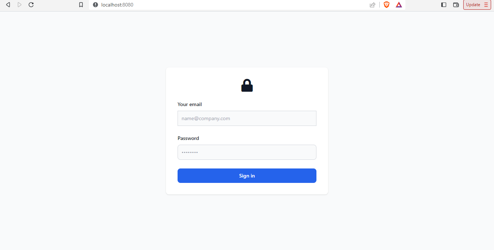
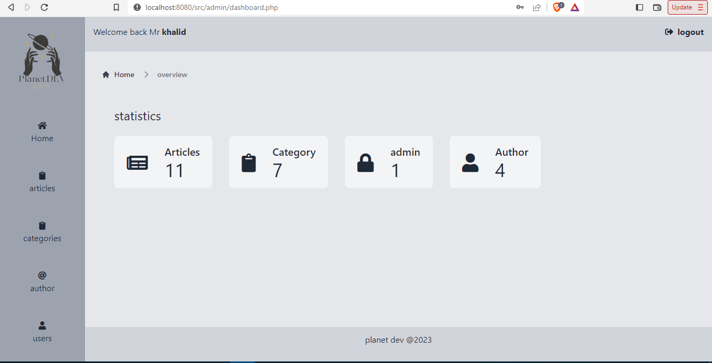
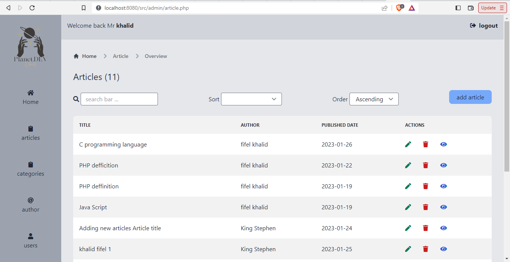
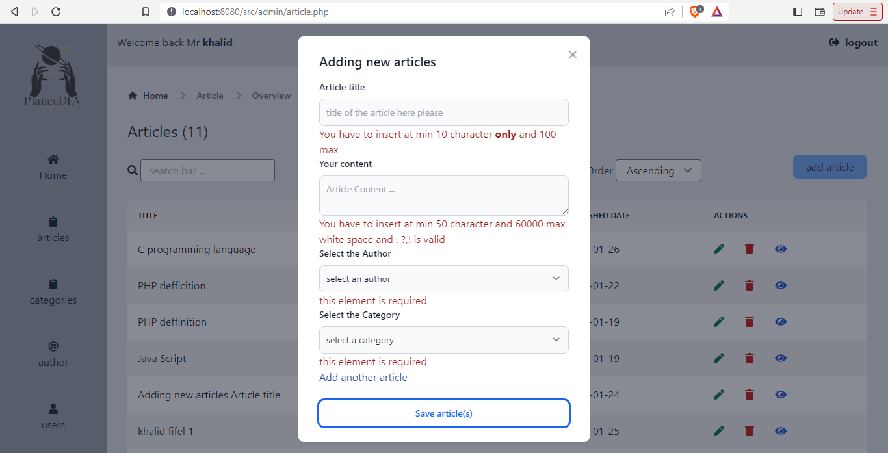
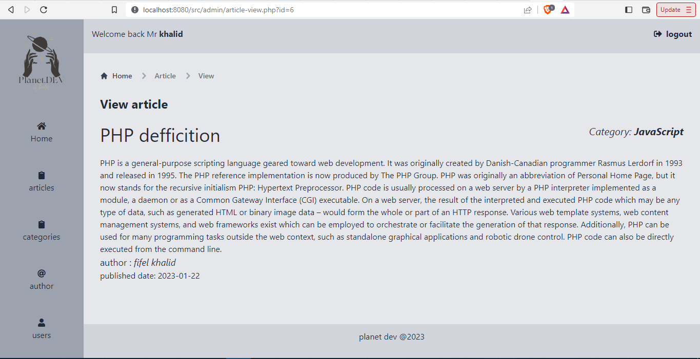
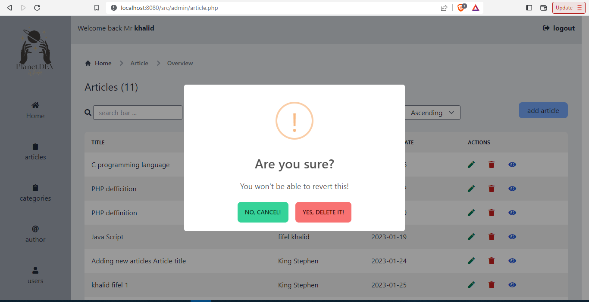
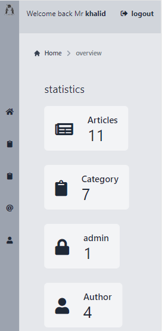
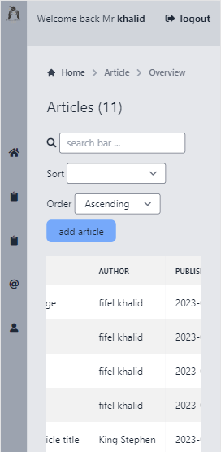
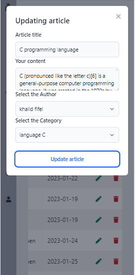

<h1>Planet Dev : </h1> 
    
est une communauté de développeurs qui se réunissent autour de la découverte et de l'exploration de l'actualité du développement.

La première phase du projet est de réaliser un dashboard admin qui permettra de gérer les contenus des actualités du veille technologie.

<h1>
    To start the app: 
</h1>
    
     php -S "localhost:8080"

<h2>Demo:</h2>

<h3>Login page:</h3>

<h3>Dashboard admin:</h3>

<h3>All Articles :</h3>

<h3>Add one or more Articles :</h3>

<h3>Overview articles:</h3>

<h3>Delete articles:</h3>

<h1>Mobile UI:</h1>

<h3>Dashboard admin:</h3>

<h3>All Articles :</h3>

<h3>Update article:</h3>

    

